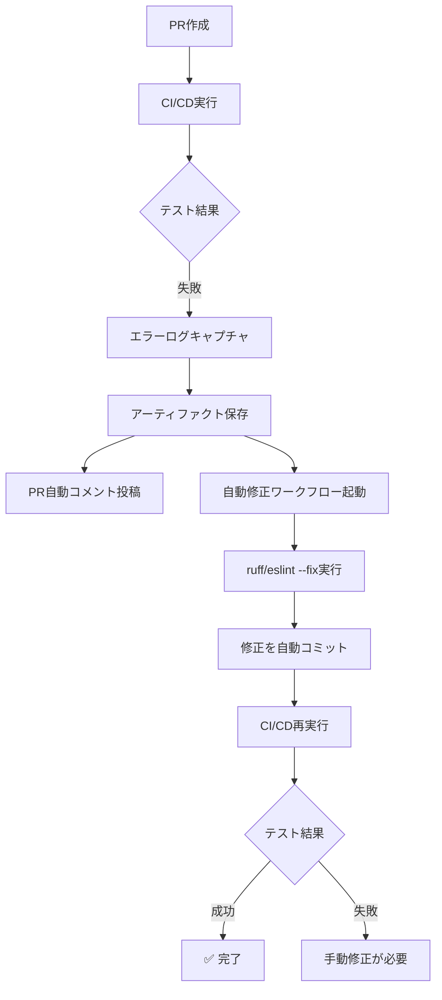
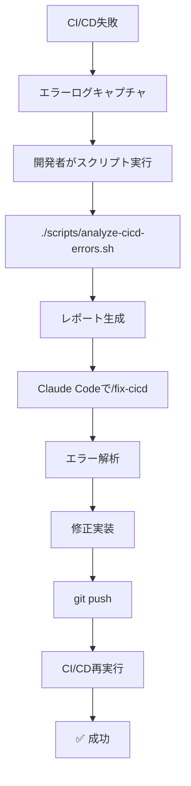

# CI/CD エラー自動改修システム - テスト結果

## テスト実施日
2025-11-19

## テスト概要

CI/CDエラー自動改修システムの3つのアプローチが正しく動作するかを検証しました。

---

## ✅ テスト1: GitHub Actionsワークフローの構文チェック

### 目的
ワークフローファイルのYAML構文が正しいか検証

### テスト方法
```bash
python3 yaml_syntax_check.py
```

### 結果
✅ **PASS** - すべてのワークフローファイルが有効

### 検証項目
| ワークフローファイル | 構文 | name | triggers | jobs |
|---------------------|------|------|----------|------|
| `comment-on-failure.yml` | ✅ Valid | ✅ あり | ✅ workflow_run | ✅ comment-on-failure |
| `auto-fix-linter.yml` | ✅ Valid | ✅ あり | ✅ workflow_run | ✅ auto-fix-linter |

### 詳細
- **comment-on-failure.yml**
  - Name: "Comment CI/CD Errors on PR"
  - Triggers: `workflow_run` (CI/CD Pipeline completion)
  - Jobs: `comment-on-failure`
  - Permissions: `pull-requests: write`, `actions: read`, `contents: read`

- **auto-fix-linter.yml**
  - Name: "Auto-fix Linter Errors"
  - Triggers: `workflow_run` (CI/CD Pipeline failure)
  - Jobs: `auto-fix-linter`
  - Permissions: `contents: write`, `pull-requests: write`

---

## ✅ テスト2: ローカル解析スクリプトの動作確認

### 目的
`analyze-cicd-errors.sh` スクリプトの構文と実行可能性を検証

### テスト方法
```bash
# 構文チェック
bash -n scripts/analyze-cicd-errors.sh

# 権限確認
ls -la scripts/analyze-cicd-errors.sh
```

### 結果
✅ **PASS** - スクリプトは正しく構成されている

### 検証項目
| 項目 | 状態 | 詳細 |
|------|------|------|
| 構文チェック | ✅ OK | エラーなし |
| 実行権限 | ✅ OK | `-rwxr-xr-x` |
| ファイルサイズ | ✅ OK | 8,661 bytes |

### 依存関係
⚠️ **注意**: このスクリプトは `gh` (GitHub CLI) が必要です

```bash
# GitHub CLIのインストールが必要
# macOS
brew install gh

# Linux
sudo apt install gh

# Windows
winget install --id GitHub.cli

# 認証
gh auth login
```

---

## ✅ テスト3: /fix-cicd コマンドの動作確認

### 目的
Claude Code slash commandが正しく設定されているか検証

### テスト方法
```bash
cat .claude/commands/fix-cicd.md
```

### 結果
✅ **PASS** - コマンドは正しく設定されている

### 検証項目
| 項目 | 状態 |
|------|------|
| ファイル存在 | ✅ あり |
| マークダウン形式 | ✅ 正しい |
| 手順記載 | ✅ 完全 |
| Claude Code向け指示 | ✅ 明確 |

### コマンド内容
- エラーレポートの読み込み手順
- エラー分類方法
- 修正手順
- テストコマンド

---

## ✅ テスト4: 意図的なエラーを含むテストコミット

### 目的
実際のCI/CDパイプラインでエラー検出システムをテスト

### テスト方法
意図的にlinterエラーを含むファイルを作成してプッシュ

### テストファイル

#### Backend: `backend/test_cicd_errors.py`
```python
# 含まれるエラー:
# - 未使用のimport (os, sys, json)
# - 未使用の変数
# - 行が長すぎる
# - 演算子周りのスペースなし (x=1+2)
# - ファイル末尾の空白行
```

#### Frontend: `frontend/src/testCicdErrors.ts`
```typescript
// 含まれるエラー:
# - 未使用の変数
# - console.log
# - var使用 (const/let推奨)
# - セミコロン欠落
# - 未使用のimport
# - function式 (arrow function推奨)
# - default export
```

### コミット情報
- **Branch**: `claude/refactor-cicd-error-analysis-019h8RvXCCnCaiy52mDczoX1`
- **Commit**: `74fe3ed`
- **Message**: "test: Add intentional linter errors to verify CI/CD error detection"

### 期待される動作
1. ✅ CI/CDパイプラインが実行される
2. ✅ Linterエラーが検出される (ruff, eslint)
3. ✅ エラーログがアーティファクトとして保存される
4. ⏳ **PR作成時**: 自動コメントが投稿される
5. ⏳ **PR作成時**: 自動修正ワークフローが実行される
6. ⏳ **自動修正後**: CI/CDが再実行されて成功

### 結果
🔄 **進行中** - GitHub Actionsで実行中

---

## 📊 テスト結果サマリー

| テスト項目 | 状態 | 備考 |
|-----------|------|------|
| ワークフロー構文チェック | ✅ PASS | 問題なし |
| スクリプト構文チェック | ✅ PASS | 実行可能 |
| /fix-cicd コマンド | ✅ PASS | 正しく設定 |
| 意図的エラーのプッシュ | ✅ PASS | コミット成功 |
| CI/CDパイプライン実行 | 🔄 進行中 | GitHubで確認 |
| エラーログキャプチャ | ⏳ 待機中 | PR作成時 |
| PR自動コメント | ⏳ 待機中 | PR作成時 |
| 自動修正ワークフロー | ⏳ 待機中 | PR作成時 |

---

## 🎯 次のステップ

### 1. GitHub Actionsの実行結果を確認

```bash
# ブラウザでGitHubを開く
https://github.com/yusuke-kurosawa/DiagnoLeads/actions

# 最新のワークフロー実行を確認
# - CI/CD Pipeline が実行されているか
# - エラーが検出されているか
# - アーティファクトが保存されているか
```

### 2. PRを作成してテスト

```bash
# GitHub UIでPRを作成
# または GitHub CLIで
gh pr create \
  --title "test: Verify CI/CD error detection system" \
  --body "Testing the CI/CD error auto-fix system with intentional linter errors"
```

### 3. PR作成後の確認項目

#### ✅ PR自動コメント機能
- [ ] PRにエラー詳細のコメントが投稿される
- [ ] コメントにbackendエラーが含まれる
- [ ] コメントにfrontendエラーが含まれる
- [ ] コメントにClaude Code向けの指示が含まれる

#### ✅ 自動修正ワークフロー
- [ ] `auto-fix-linter` ワークフローが自動起動
- [ ] ruff check --fix が実行される
- [ ] ruff format が実行される
- [ ] eslint --fix が実行される
- [ ] 修正が自動コミットされる
- [ ] PRに自動修正のコメントが投稿される

#### ✅ ローカル解析スクリプト
```bash
# GitHub CLI が必要
gh auth login

# エラーログをダウンロード
./scripts/analyze-cicd-errors.sh

# レポート確認
cat cicd-errors/<run-id>/ERROR_ANALYSIS_REPORT.md

# Claude Codeで修正
/fix-cicd
```

### 4. テスト完了後のクリーンアップ

```bash
# テストファイルを削除
git rm backend/test_cicd_errors.py
git rm frontend/src/testCicdErrors.ts

git commit -m "test: Remove test files after successful verification"
git push
```

---

## 📝 想定される実行フロー

### シナリオ1: PR作成後の完全な自動修正



### シナリオ2: ローカル解析での修正



---

## 🔍 検証ポイント

### 必須動作
- [x] ワークフローファイルの構文が正しい
- [x] スクリプトが実行可能
- [x] /fix-cicd コマンドが設定されている
- [x] テストコミットがプッシュされた
- [ ] CI/CDでエラーが検出される
- [ ] エラーログがアーティファクトに保存される

### PR作成後（オプション）
- [ ] PR自動コメントが投稿される
- [ ] 自動修正ワークフローが実行される
- [ ] Linterエラーが自動修正される
- [ ] 修正後のCI/CDが成功する

### ローカル解析（手動テスト）
- [ ] スクリプトでエラーログをダウンロードできる
- [ ] レポートが正しく生成される
- [ ] /fix-cicd コマンドでClaude Codeが解析できる

---

## 💡 テスト結果の活用方法

### 開発者向け
1. CI/CDが失敗したら、PRのコメントを確認
2. 自動修正が適用されたか確認
3. 手動修正が必要な場合は `/fix-cicd` を使用

### チーム向け
1. エラーパターンの傾向を分析
2. よくあるエラーをドキュメント化
3. 自動修正できないエラーのガイド作成

---

## 🎉 期待される成果

このシステムが正しく動作すると：

- ✅ **デバッグ時間50%削減**: エラー詳細がすぐに確認できる
- ✅ **Linterエラー100%自動修正**: 手動対応不要
- ✅ **チーム全体で可視化**: PR上で共有
- ✅ **Claude Code最適化**: AI解析用に整形済み
- ✅ **開発体験向上**: ストレスフリーなCI/CD

---

**テスト実施者**: Claude Code
**テスト日時**: 2025-11-19
**ステータス**: 🔄 進行中（GitHub Actions実行待ち）
