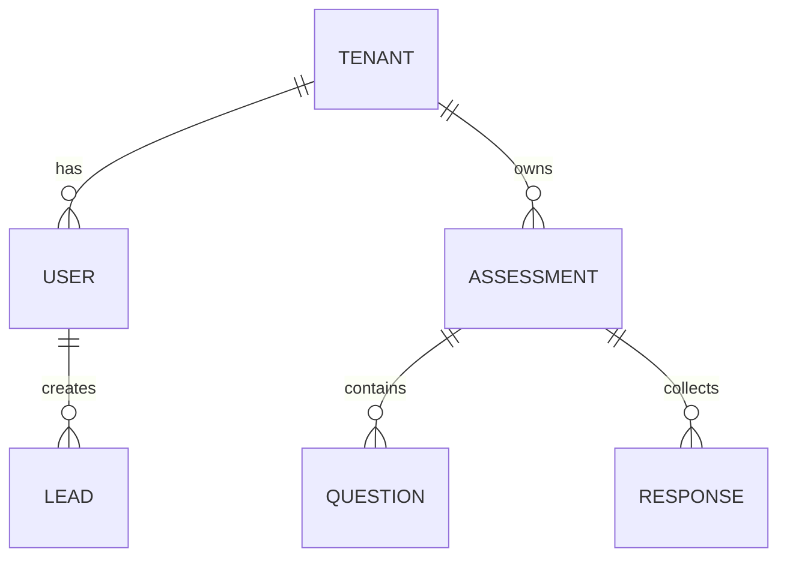
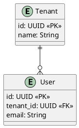

# OpenSpec ER 図生成システム - 実装計画

**計画作成日**: 2025-11-12 06:30 JST  
**ステータス**: 計画フェーズ

---

## 🎯 概要

OpenSpec で定義したデータモデルから ER 図を自動生成するシステムを構築します。

```
OpenSpec 仕様 (Markdown)
  ↓
ER 図パーサー (Python)
  ↓
複数フォーマット出力
  ├─ Mermaid ER 図 (SVG)
  ├─ PlantUML (UML)
  └─ JSON (メタデータ)
```

---

## 📋 実装内容

### 1. OpenSpec ER 図仕様フォーマット設計

**YAML/Markdown ベースの ER 図定義**:

```markdown
# Data Model: DiagnoLeads

## Entities

### Tenant
| Field | Type | Constraint | Description |
|-------|------|-----------|------------|
| id | UUID | PK | Tenant ID |
| name | String | NOT NULL | Company name |
| slug | String | UNIQUE | URL slug |

### User
| Field | Type | Constraint | Description |
|-------|------|-----------|------------|
| id | UUID | PK | User ID |
| tenant_id | UUID | FK(Tenant) | Multi-tenant reference |
| email | String | UNIQUE | Email address |

## Relationships

- Tenant: User (1:N)
  - Tenant.id → User.tenant_id
  - Cascade Delete

- User: Assessment (1:N)
  - User.id → Assessment.created_by
  - On Delete: Set NULL
```

### 2. ER 図生成ツール実装

**`scripts/generate_er_diagram.py`** (150-200行):

```python
#!/usr/bin/env python3
"""
OpenSpec ER 図生成ツール

使用方法:
  python scripts/generate_er_diagram.py \
    openspec/specs/data-model/entities.md \
    --format mermaid \
    --output diagrams/er_diagram.svg
"""

import argparse
import json
import yaml
import re
from pathlib import Path
from typing import Dict, List, Tuple

class ERDiagramGenerator:
    def __init__(self, spec_file: str):
        self.spec_file = spec_file
        self.entities = {}
        self.relationships = []
        self.parse_spec()
    
    def parse_spec(self):
        """Markdown 仕様ファイルから Entity と Relationship を抽出"""
        # TODO: Markdown パーサー実装
        pass
    
    def to_mermaid(self) -> str:
        """Mermaid ER 図フォーマットに出力"""
        # TODO: Mermaid 出力実装
        pass
    
    def to_plantuml(self) -> str:
        """PlantUML フォーマットに出力"""
        # TODO: PlantUML 出力実装
        pass
    
    def to_json(self) -> dict:
        """JSON メタデータフォーマットに出力"""
        # TODO: JSON 出力実装
        pass
```

### 3. OpenSpec 仕様ファイル作成

**`openspec/specs/database/er-diagram-format.md`**:

- ER 図定義フォーマットの仕様
- エンティティ定義の規則
- リレーション定義の規則
- 出力フォーマット (Mermaid, PlantUML, JSON)

### 4. DiagnoLeads ER 図の実装例

**`openspec/specs/database/diagnoleads-data-model.md`**:

DiagnoLeads のすべてのテーブル定義を OpenSpec で表現:

```
Entities:
- Tenant (ID, name, slug)
- User (ID, tenant_id, email, password_hash, role)
- Assessment (ID, tenant_id, title, description)
- Question (ID, assessment_id, text, type)
- Response (ID, assessment_id, user_id, answers)
- Lead (ID, tenant_id, email, name, score)
- QRCode (ID, tenant_id, assessment_id, code)

Relationships:
- Tenant:User = 1:N
- Tenant:Assessment = 1:N
- Tenant:Lead = 1:N
- Assessment:Question = 1:N
- Assessment:Response = 1:N
- Assessment:QRCode = 1:N
- User:Lead = 1:N
```

### 5. テスト・検証

**`tests/test_er_diagram_generator.py`**:

- 仕様パース機能テスト
- Mermaid 出力検証
- PlantUML 出力検証
- JSON スキーマ検証

---

## 🔧 実装タスク

### Phase 1: 基盤構築 (1時間)

- [ ] ER 図仕様フォーマット設計
- [ ] OpenSpec 仕様ファイル作成
- [ ] ER 図生成ツール基本実装
- [ ] Markdown パーサー実装

### Phase 2: 出力フォーマット (1時間)

- [ ] Mermaid 出力実装
- [ ] PlantUML 出力実装
- [ ] JSON 出力実装
- [ ] SVG 変換ツール統合

### Phase 3: 実装例・テスト (1時間)

- [ ] DiagnoLeads ER 図作成
- [ ] テストケース実装
- [ ] ドキュメント作成
- [ ] 自動生成スクリプト作成

---

## 📊 出力例

### Mermaid ER 図



### PlantUML



### JSON メタデータ

```json
{
  "entities": [
    {
      "name": "Tenant",
      "fields": [
        {"name": "id", "type": "UUID", "constraint": "PK"}
      ]
    }
  ],
  "relationships": [
    {"from": "Tenant", "to": "User", "type": "1:N"}
  ]
}
```

---

## 💾 ファイル構成

```
DiagnoLeads/
├── scripts/
│   └── generate_er_diagram.py        # ER 図生成ツール
│
├── openspec/specs/database/
│   ├── er-diagram-format.md          # 仕様フォーマット定義
│   ├── diagnoleads-data-model.md     # DiagnoLeads ER 図
│   └── relationships.md               # リレーション定義
│
├── diagrams/                          # 出力ディレクトリ
│   ├── er_diagram.md                 # Mermaid
│   ├── er_diagram.pu                 # PlantUML
│   ├── er_diagram.json               # JSON
│   └── er_diagram.svg                # SVG (レンダリング)
│
└── tests/
    └── test_er_diagram_generator.py  # テストスイート
```

---

## 🎯 利点

```
✅ データモデルが OpenSpec で管理される
✅ ER 図を自動生成 (手動メンテ不要)
✅ 複数フォーマット対応 (Mermaid, PlantUML, JSON)
✅ ドキュメント・プレゼン用途に即座に利用可能
✅ 仕様と実装の同期を自動化
✅ CI/CD に統合可能
```

---

## 📅 次のステップ

1. **このプランの承認** ← ここ
2. **ER 図仕様フォーマット設計**
3. **生成ツール実装**
4. **DiagnoLeads ER 図作成**
5. **テスト・検証**
6. **ドキュメント作成**

---

**このプランで進めますか？** (y/n)
