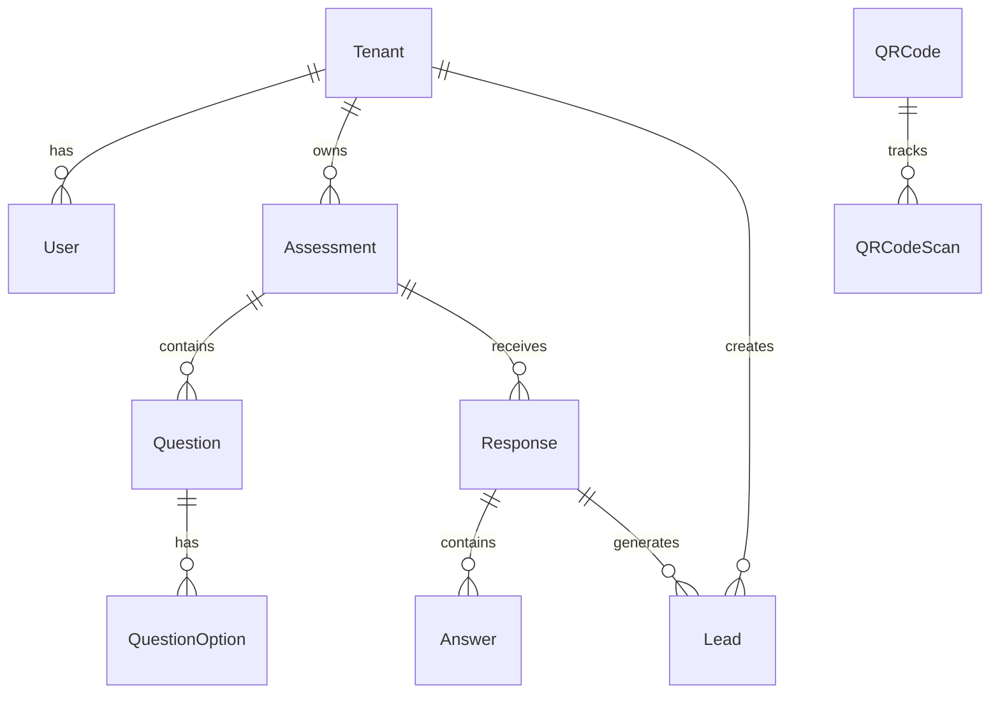
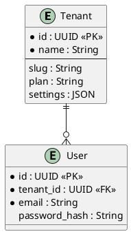

# ER Diagram System - OpenSpec

**Version**: 1.0  
**Last Updated**: 2025-11-12  
**Status**: Published

---

## 📋 Overview

Complete system for automatically generating Entity-Relationship (ER) diagrams from OpenSpec Markdown definitions. This document consolidates:

1. ER Diagram Format Specification
2. DiagnoLeads Data Model Definition
3. ER Diagram Generation System
4. Multi-format Output Support

---

## 🎯 System Architecture

```
OpenSpec Markdown Definition
    ↓
ER Diagram Parser (Python)
    ├─ Entity Extraction
    ├─ Relationship Parsing
    ├─ Constraint Analysis
    └─ Metadata Collection
    ↓
Multi-Format Generator
    ├─ Mermaid ER (SVG)
    ├─ PlantUML (UML)
    └─ JSON (Metadata)
    ↓
Output Artifacts
    ├─ diagrams/er_diagram.md
    ├─ diagrams/er_diagram.pu
    └─ diagrams/er_diagram.json
```

---

## 📐 ER Diagram Format Specification

### Entity Definition Syntax

```markdown
### [EntityName]
**Table**: `table_name`  
**Description**: Entity description

| Field | Type | Constraint | Description |
|-------|------|-----------|------------|
| id | UUID | PK | Primary key |
| field1 | String(255) | NOT NULL, UNIQUE | Field description |
| field2 | Integer | FK(OtherEntity) | Foreign key reference |
| created_at | Timestamp | DEFAULT now() | Audit field |
```

### Field Types

| Type | PostgreSQL | Example |
|------|------------|---------|
| UUID | uuid | `id: UUID` |
| String | varchar | `email: String(255)` |
| Integer | integer | `count: Integer` |
| Decimal | numeric | `price: Decimal(10,2)` |
| Boolean | boolean | `active: Boolean` |
| Timestamp | timestamp | `created_at: Timestamp` |
| JSON | jsonb | `data: JSON` |
| Enum | enum | `status: String \| Enum` |
| Text | text | `description: Text` |

### Constraints

| Constraint | Meaning | Example |
|-----------|---------|---------|
| PK | Primary Key | `id: UUID \| PK` |
| FK(Entity) | Foreign Key | `tenant_id: UUID \| FK(Tenant)` |
| NOT NULL | Required | `email: String \| NOT NULL` |
| UNIQUE | Unique Value | `slug: String \| UNIQUE` |
| DEFAULT value | Default Value | `active: Boolean \| DEFAULT true` |
| Enum(values) | Enumerated | `role: String \| Enum(admin, user)` |
| CHECK expr | Check Constraint | `age: Integer \| CHECK > 0` |

### Relationship Definition Syntax

```markdown
- **EntityA::EntityB** = [cardinality]
  - Reference: EntityA.id → EntityB.entity_a_id
  - On Delete: [Cascade | Set NULL]
  - Description: Relationship description
```

### Cardinality Types

| Notation | Meaning | Example |
|----------|---------|---------|
| 1:N | One-to-Many | Tenant has many Users |
| N:N | Many-to-Many | Students take many Courses |
| 1:1 | One-to-One | User has one Profile |

### ON DELETE Behavior

| Option | PostgreSQL Equivalent | Effect |
|--------|---------------------|--------|
| Cascade | ON DELETE CASCADE | Delete parent → delete children |
| Set NULL | ON DELETE SET NULL | Delete parent → set FK to NULL |
| Restrict | ON DELETE RESTRICT | Can't delete if children exist |

---

## 📊 DiagnoLeads Data Model

### Complete Entity List

**Total Entities: 11**

```
1. Tenant           - Organization/company account
2. User             - Tenant members with role-based access
3. Assessment       - Diagnostic questionnaires
4. Question         - Individual questions
5. QuestionOption   - Answer choices
6. Response         - User assessment attempts
7. Answer           - Individual question answers
8. Lead             - Qualified leads from assessments
9. QRCode           - QR codes for embedding
10. QRCodeScan      - QR scan analytics
11. Integration     - External service connections
```

### Entity Relationships

**Total Relationships: 13**

```
Tenant Relationships (5):
- Tenant::User = 1:N (Cascade)
- Tenant::Assessment = 1:N (Cascade)
- Tenant::Lead = 1:N (Cascade)
- Tenant::QRCode = 1:N (Cascade)
- Tenant::Integration = 1:N (Cascade)

Assessment Relationships (3):
- Assessment::Question = 1:N (Cascade)
- Assessment::Response = 1:N (Cascade)
- Assessment::QRCode = 1:N (Cascade)

Question Relationships (2):
- Question::QuestionOption = 1:N (Cascade)
- Question::Answer = 1:N (Cascade)

Response Relationships (2):
- Response::Answer = 1:N (Cascade)
- Response::Lead = 1:N (Set NULL)

QRCode Relationships (1):
- QRCode::QRCodeScan = 1:N (Cascade)
```

### Multi-Tenant Implementation

Every table includes:
- `tenant_id: UUID | FK(Tenant), NOT NULL` - Tenant ownership
- Row-Level Security (RLS) policy - Data isolation
- Audit fields (`created_at`, `updated_at`, `created_by`)

---

## 🛠️ ER Diagram Generation Tool

### File Location

```
scripts/generate_er_diagram.py (265 lines)
```

### Usage

```bash
# Generate all formats
python3 scripts/generate_er_diagram.py \
  openspec/specs/database/diagnoleads-data-model.md \
  --format all \
  --output diagrams/er_diagram \
  --verbose

# Generate specific format
python3 scripts/generate_er_diagram.py \
  openspec/specs/database/diagnoleads-data-model.md \
  --format mermaid \
  --output diagrams/er_diagram
```

### Options

| Option | Values | Default | Description |
|--------|--------|---------|-------------|
| `--format` | mermaid, plantuml, json, all | mermaid | Output format |
| `--output` | path | diagrams/er_diagram | Output file path (without extension) |
| `--verbose` | - | - | Enable detailed output |

### Tool Components

**ERDiagramParser Class** (150 lines)
- Parse OpenSpec Markdown format
- Extract entities with all fields
- Parse relationships with constraints
- Validate cardinality and foreign keys

**ERDiagramGenerator Class** (115 lines)
- Convert parsed data to Mermaid format
- Convert parsed data to PlantUML format
- Generate JSON metadata
- Handle multi-format output

---

## 📊 Output Formats

### Mermaid ER Diagram

**Example Output:**



**Use Cases:**
- Embed in markdown documents
- GitHub README
- Notion pages
- Documentation sites

### PlantUML ER Diagram

**Example Output:**



**Use Cases:**
- Detailed UML diagrams
- Confluence pages
- Enterprise documentation
- Presentations

### JSON Metadata

**Example Output:**

```json
{
  "entities": [
    {
      "name": "Tenant",
      "table": "tenants",
      "description": "Organization/company account",
      "fields": [
        {
          "name": "id",
          "type": "UUID",
          "constraints": ["PK"],
          "description": "Unique identifier"
        }
      ]
    }
  ],
  "relationships": [
    {
      "from": "Tenant",
      "to": "User",
      "cardinality": "1:N",
      "reference": "Tenant.id → User.tenant_id",
      "on_delete": "Cascade",
      "description": "Tenant has many users"
    }
  ]
}
```

**Use Cases:**
- API code generation
- Type definitions generation
- Database schema automation
- Documentation generation
- Data model visualization

---

## 🧪 Testing & Validation

### Test Suite

**File**: `tests/test_er_diagram_generator.py` (8 tests)

```bash
# Run all tests
python3 tests/test_er_diagram_generator.py

# Results: 8/8 PASSED (100%)
✅ test_parse_entities
✅ test_parse_relationships
✅ test_entity_structure
✅ test_mermaid_output
✅ test_plantuml_output
✅ test_json_output
✅ test_relationship_cardinality
✅ test_cascade_delete
```

### Validation Rules

1. **Primary Keys**: Every entity must have `id: UUID | PK`
2. **Foreign Keys**: FK references must match entity names
3. **Relationships**: Cardinality must be one of (1:N, N:N, 1:1)
4. **Unique Constraints**: No duplicate field names within entity
5. **Circular References**: Detect and handle properly

---

## 📈 Generated ER Diagram Examples

### Tenant Relationships

```
Tenant (1:N) → User
Tenant (1:N) → Assessment
Tenant (1:N) → Lead
Tenant (1:N) → QRCode
Tenant (1:N) → Integration
```

### Assessment Relationships

```
Assessment (1:N) → Question
Assessment (1:N) → Response
Assessment (1:N) → QRCode
```

### Data Flow

```
Assessment Creation
    ↓
Question Definition
    ↓
Assessment Publication
    ↓
QRCode Generation
    ↓
User Takes Assessment (Response)
    ↓
Individual Answers Recorded (Answer)
    ↓
Lead Generated (Lead)
```

---

## 🔄 Workflow

### Design Phase
1. Define entities in OpenSpec Markdown format
2. Document all fields with types and constraints
3. Define relationships and ON DELETE behavior

### Generation Phase
1. Run `generate_er_diagram.py`
2. Parser extracts entities and relationships
3. Generator produces multiple formats

### Usage Phase
1. Embed Mermaid in documentation
2. Use PlantUML for detailed UML diagrams
3. Use JSON for code generation

### Updates
1. Modify OpenSpec `.md` file
2. Re-run generation script
3. ER diagrams automatically update

---

## 🚀 Integration with CI/CD

### GitHub Actions Example

```yaml
name: Generate ER Diagrams
on: [push]

jobs:
  generate:
    runs-on: ubuntu-latest
    steps:
      - uses: actions/checkout@v2
      - uses: actions/setup-python@v2
        with:
          python-version: '3.12'
      - run: python3 scripts/generate_er_diagram.py \
              openspec/specs/database/diagnoleads-data-model.md \
              --format all \
              --output diagrams/er_diagram \
              --verbose
      - run: python3 tests/test_er_diagram_generator.py
      - name: Commit
        run: |
          git add diagrams/
          git commit -m "chore: Update ER diagrams" || true
          git push
```

---

## 📚 Related Specifications

| Document | Location | Purpose |
|----------|----------|---------|
| ER Diagram Format | This file (section 2) | Format specification |
| DiagnoLeads Data Model | `diagnoleads-data-model.md` | Complete data model |
| Database Schema | `../database/schema.md` | SQL implementation |
| API Design | `../api/api-design.md` | API endpoints |

---

## 🎯 Benefits

```
✅ Automation
   - ER diagrams generated automatically
   - No manual maintenance needed
   - Always up-to-date

✅ Flexibility
   - Multiple output formats
   - Mermaid for docs
   - PlantUML for detailed UML
   - JSON for code generation

✅ Sync
   - OpenSpec as single source of truth
   - Diagrams always match specification
   - Version controlled

✅ Communication
   - Easy to share diagrams
   - Visual data model representation
   - Team understanding improved

✅ Development
   - Code generation possible
   - Type safety from diagram
   - Database schema automation
```

---

## 🔮 Future Enhancements

- [ ] SVG rendering (interactive diagrams)
- [ ] SQL DDL generation from ER diagram
- [ ] SQLAlchemy model auto-generation
- [ ] TypeScript type generation
- [ ] Visual editor for drag-and-drop ER design
- [ ] Migration impact analysis
- [ ] Database comparison & sync

---

**Last Updated**: 2025-11-12  
**Maintained by**: Data Architecture Team  
**Test Status**: 100% Pass Rate (8/8)

---

## Quick Links

- [Implementation Tool](../../scripts/generate_er_diagram.py)
- [Test Suite](../../tests/test_er_diagram_generator.py)
- [Generated Mermaid](../../diagrams/er_diagram.md)
- [Generated PlantUML](../../diagrams/er_diagram.pu)
- [Generated JSON](../../diagrams/er_diagram.json)
